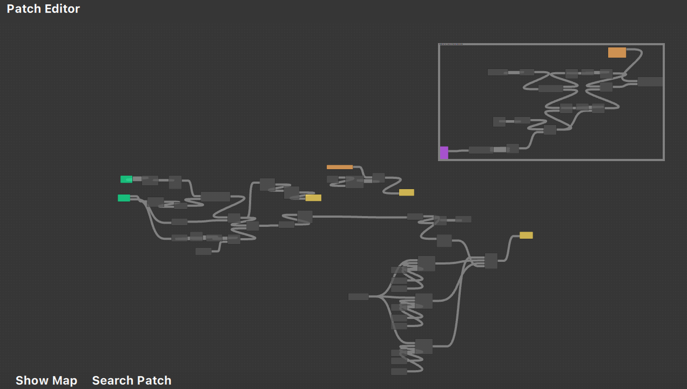
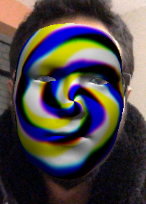

# Reconocernos

Este es un trabajo final del workshop/taller Grasshopper + AR = MAGIA
organizado por Digital Futures e impartido por el profesor Michael Hurtado.

## Motivación/Explicación

"Reconocernos" es una interpretación de la canción ["Vida en el espejo"
hecha por la banda mexicana Enjambre](https://www.youtube.com/watch?v=NxkYp6Y-wbU). Se interpreta esta canción como un diálogo
que tiene uno consigo mismo y reclama una aceptación, un reconocimiento
personal por la situación actual de la persona. Así sea la situación mås
complicada o la más llevadera, a veces es necesario un momento de reflexión, 
mirarnos al espejo, y reconocernos.

Por eso, en esta experiencia AR, mientras acercamos una mano podremos escuchar un 
trozo de esta canción mientras recuperamos la visión de nuestro rostro
nuevamente y podamos, tal vez, reconocernos.

## Recursos técnicos

Se dispone de Spark AR y Convertidores de archivos online como herramientas.

Se usaron trackers que proveen Spark AR: Hand Trackers y Face Trackers.

Para obtener el efecto de espiral en la cara, se adaptó del trabajo previo de [gcorallo](https://github.com/gcorallo/SparkArShaders)

En vez de realizar un código de GLSL (o SparkSL en este caso) para este efecto,
se empleó Patches o programación en bloques. El efecto se emplea en una textura
que utiliza un material. Este material es utilizado por el Face Mask que provee
Spark AR Studio.

Se usa Hand Trackers para la manipulación del efecto en el Face Mask y también
para el volumen del sonido reproduciendose en background durante la experiencia
AR.

## Retos técnicos

Según lo observado, no se puede detectar una mano haciendo gestos con la cara.
Por ejemplo, detectar un gesto en la que la palma de la mano cubra la mejilla.
Al hacerlo, se pierde el trackeo por el Hand Tracker y se rompe el efecto
deseado. 

Como solución, se calcula la distancia entre la mano y la cara para poder tener
una relación entre ambos y ejecutar una interacción al acercar la mano al
rostro.

## Otras Referencias

- [glslsandbox](https://glslsandbox.com/?page=1)
- [The Book of Shaders](https://thebookofshaders.com)
- [Spark AR](https://sparkar.facebook.com/ar-studio/learn/sparksl/sparksl-api/textures)
- [SparkArShaders por gcorallo](https://github.com/gcorallo/SparkArShaders)
- [ar_sfpc de Zach Lieberman](https://github.com/ofzach/ar_sfpc)

